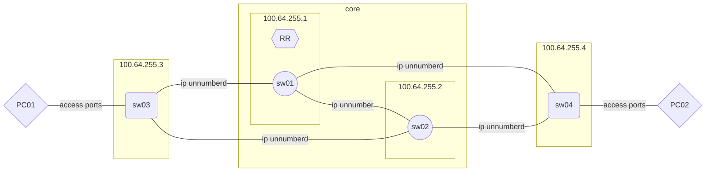

# NetAut CI/CD Demo Project


## Topology



**Note:** With `ip unnumberd` the interface itself does not need an IP address on the point-to-point links. Because we don't have an IPAM this makes the inventory easier.
{: .note}

## Environment Variable


```
NORNIR_PASSWORD=*****       # password for the user ins
NORNIR_SETTINGS=config.yaml # Path to nornir settings file
LAB_POD_NUMBER=9            # INS Pod number
```


# ToDo

Create the CI/CD pipeline
